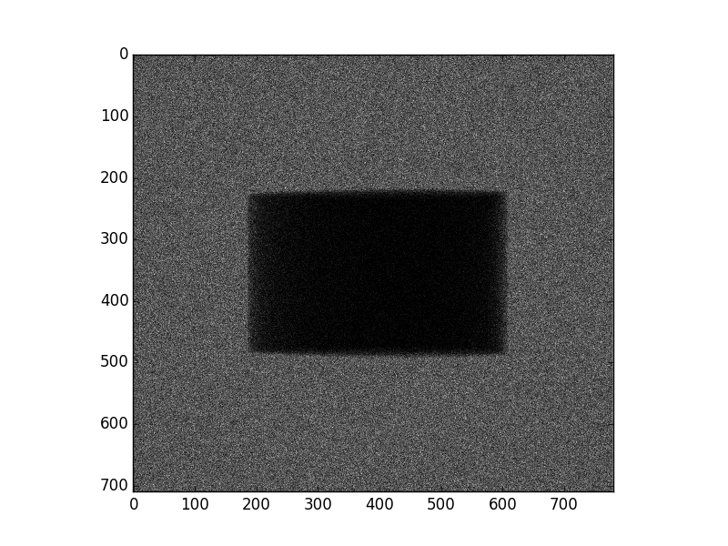
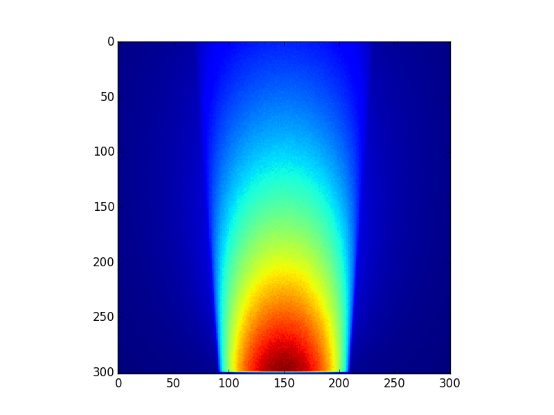
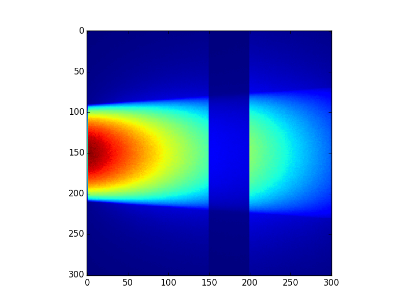
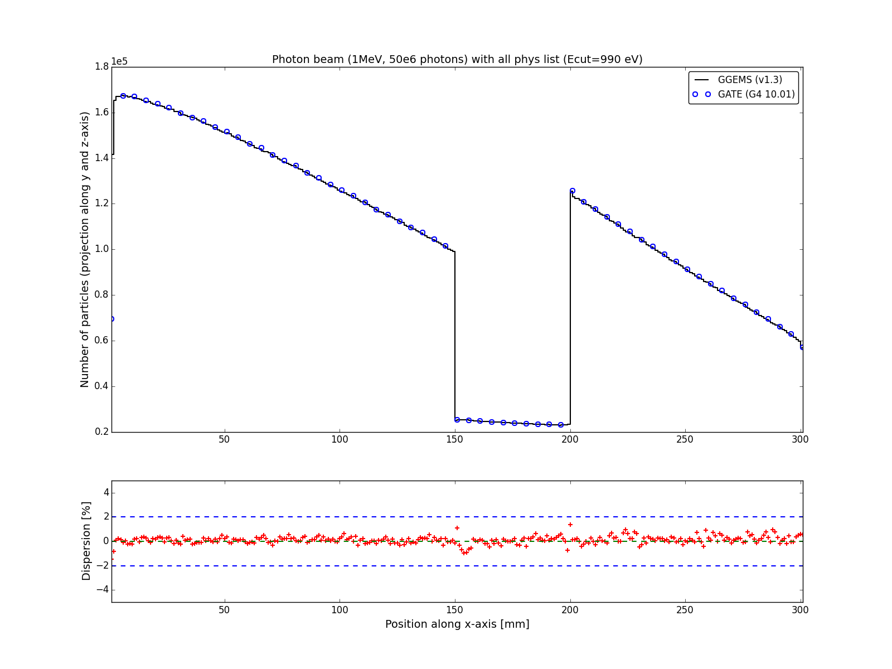
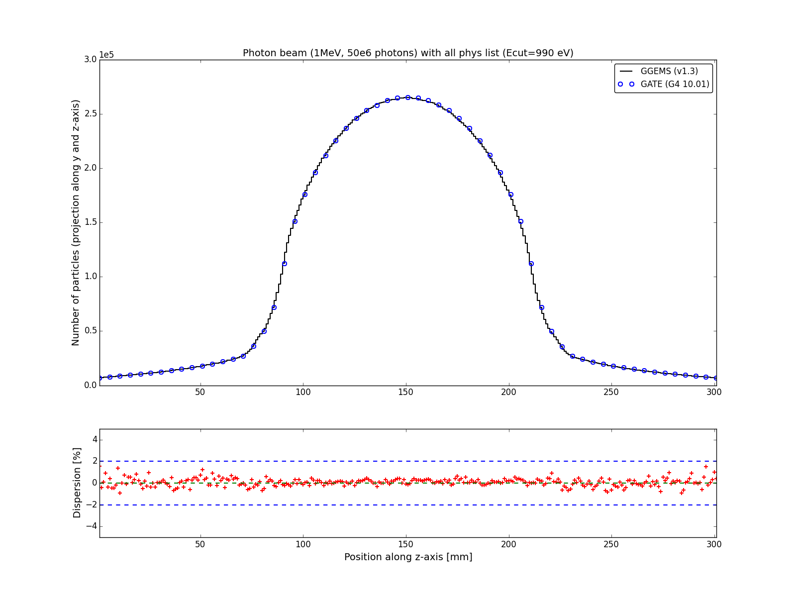
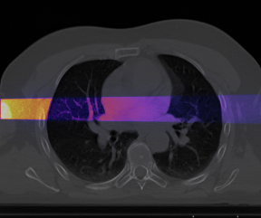
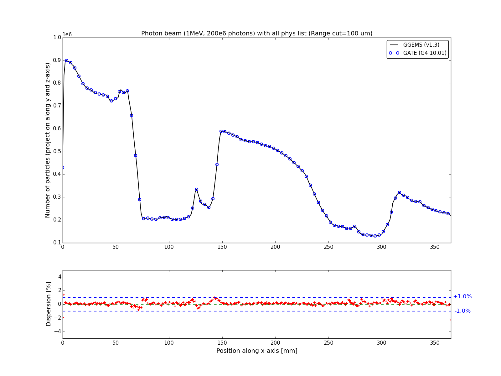
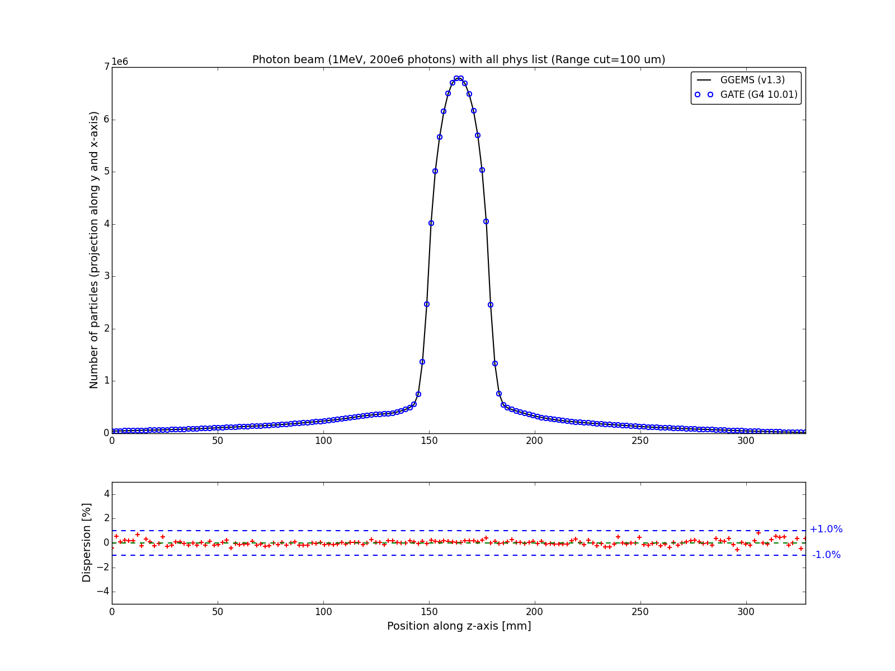

.. GGEMS documentation: Examples

.. _examples-label:

Examples
========

01_exeCT
--------

Simple example for a CT imaging application.

Data
^^^^

This example can be found in::

    [MyGGEMSInstallDirectoryPath]/samples/01_exeCT

This directory contains:

* Makefile 
    this file allows to compile this example
* main.cu 
    source code that contains the CT example
* license/ 
    the directory that contains your license file
* data/materials.dat
    the material database used by GGEMS
* data/NEMA.mhd and data/NEMA.raw
    a voxelized NEMA phantom in MetaImage format
* data/range_NEMA.dat
    the file that contains the rules to derive values of the NEMA
    phantom into materials data (obtained from materials.dat)
* data/spectrum_120kVp_2mmAl.dat
    a file that contains a CT spectrum

Execution
^^^^^^^^^

How to compile and run this example:

1. First you need to source GGEMS::

    source [MyGGEMSInstallDirectoryPath]/bin/ggems.sh

2. Do not forget to copy your license file into the license directory
   and change the filename into the ``main.cu``::

    cp LICENSE_GGEMS_LATIM.dat license/

3. Then, compile::

    make

4. And run::

    ./exeCT

This example will produce the file ``projection.mhd`` that contains a projection image. 

Listing of the code
^^^^^^^^^^^^^^^^^^^

.. code-block:: cpp
    :linenos:
    :caption: 01_exeCT

    #include <stdexcept>
    #include <ggems.cuh>

    int main( int argc, char **argv )
    {
      try
      {
        ////////////////////////////////////////////////////////////////////////////////

        // Creating a cone-beam CT (CB-CT) source
        ConeBeamCTSource *aSource = new ConeBeamCTSource;    
        aSource->set_particle_type( "photon" );    
        aSource->set_focal_size( 0.6f*mm, 1.2f*mm );
        aSource->set_beam_aperture( 8.7f*deg );
        aSource->set_position( -950.0f*mm, 0.0f*mm, 0.0f*mm );
        aSource->set_energy_spectrum( "data/spectrum_120kVp_2mmAl.dat" );
        aSource->set_orbiting( 3.6f*deg );

        // Creating a voxelized phantom
        VoxPhanImgNav *aPhantom = new VoxPhanImgNav;   
        aPhantom->load_phantom_from_mhd( "data/NEMA.mhd", 
                                         "data/range_NEMA.dat" );
        aPhantom->set_materials( "data/materials.dat" );

        // Defined a detector
        CTDetector *aDetector = new CTDetector;    
        aDetector->set_dimension( 1, 780, 710 ); // in pixel
        aDetector->set_pixel_size( 0.600f*mm, 0.368f*mm, 0.368f*mm );
        aDetector->set_position( 320.3f*mm, 0.0f*mm, 0.0f*mm );
        aDetector->set_threshold( 10.0f*keV );
        aDetector->set_orbiting( 3.6f*deg );  // same angle from the source

        ////////////////////////////////////////////////////////////////////////////////

        // GGEMS simulation
        GGEMS *simu = new GGEMS;

        // Licence
        simu->set_license( "license/YOUR_LICENSE_FILE.dat" );   // <-- NEED TO CHANGE HERE

        // GPU parameters
        simu->set_hardware_target( "GPU" );
        simu->set_GPU_block_size( 192 );
        simu->set_GPU_ID( 0 );

        // Physics parameters
        simu->set_process( "Compton" );
        simu->set_process( "PhotoElectric" );
        simu->set_process( "Rayleigh" );
        simu->set_particle_cut( "photon", 0.5 *mm );
        
        // Random and particles
        simu->set_seed( 123456789 );
        simu->set_number_of_particles( 1000000 );
        simu->set_size_of_particles_batch( 100000 );  // Depending of the memory size avaialble on the GPU card

        // Source, phantom and detector
        simu->set_source( aSource );
        simu->set_phantom( aPhantom );
        simu->set_detector( aDetector );

        // Verbose
        simu->set_display_in_color( true );
        simu->set_display_memory_usage( true );

        // Initialization of the simulation
        simu->init_simulation();

        // Start the simulation
        simu->start_simulation();

        // Store the final image and the scatter
        aDetector->save_projection( "projection.mhd" );

        //////////////////////////////////////////////////////////////////////////////////

        // Deleting the simulation
        delete simu;

        // Deleting the source
        delete aSource;

        // Deleting the phantom
        delete aPhantom;

        // Deleting the detector
        delete aDetector;

      }
      catch( std::exception& e )
      {
        GGcerr << e.what() << GGendl;
      }
      catch( ... )
      {
        GGcerr << "Unknown exception!!!" << GGendl;
      }

      // Exiting the code successfully
      std::exit( EXIT_SUCCESS );
    }

Results
^^^^^^^

Example of projection result for :math:`10^7` particles (23 s with GTX690):

----

02_exePhotonBeam_WaterBox
-------------------------

Mono-energy photon beam with a water box phantom. Simple example of dosimetry. 

Data
^^^^

This example can be found in::

    [MyGGEMSInstallDirectoryPath]/samples/02_exePhotonBeam_WaterBox

This directory contains:

* Makefile 
    this file allows to compile this example
* main.cu 
    source code that contains the dosimetry example
* license/ 
    the directory that contains your license file
* data/materials.dat
    the material database used by GGEMS
* data/waterbox.mhd and data/waterbox.raw.
    a voxelized waterbox phantom in MetaImage format. This phantom has only one voxel
    in order to simulate an homogeneous analytical box.
* data/water.dat
    the file that contains the rules to derive values of the
    phantom into materials data (obtained from materials.dat)

Execution
^^^^^^^^^

How to compile and run this example:

1. First you need to source GGEMS::

    source [MyGGEMSInstallDirectoryPath]/bin/ggems.sh

2. Do not forget to copy your license file into the license directory
   and change the filename into the ``main.cu``::

    cp LICENSE_GGEMS_LATIM.dat license/

3. Then, compile::

    make

4. And run::

    ./exePhotonBeam

This example will produce these files:

* results-Dose.mhd and .raw: final dose map in MetaImage format
* results-Edep.mhd and .raw: Deposited energy within the phantom
* results-Hit.mhd and .raw: Number of hits within the phantom
* results-Uncertainty.mhd and .raw: Dose uncertainty

Listing of the code
^^^^^^^^^^^^^^^^^^^

.. code-block:: cpp
    :linenos:
    :caption: 02_exePhotonBeam_WaterBox

    #include <stdexcept>
    #include <ggems.cuh>

    int main( int argc, char **argv )
    {
      try
      {
         
        ////////////////////////////////////////////////////////////////       

        // Creating a cone-beam source
        ConeBeamCTSource *aSource = new ConeBeamCTSource;    
        aSource->set_particle_type( "photon" );
        aSource->set_focal_size( 0.0f, 0.0f );
        aSource->set_beam_aperture( 4.0f *deg );    
        aSource->set_position( 0.0f *m, 0.0f *m, 1.0f *m );
        aSource->set_mono_energy( 1.0f *MeV );

        // Creating a voxelized phantom with a dosemap   
        VoxPhanDosiNav* aPhantom = new VoxPhanDosiNav();
        aPhantom->load_phantom_from_mhd("data/waterbox.mhd", 
                                        "data/water.dat" );       
        aPhantom->set_materials( "data/materials.dat" );
        aPhantom->set_doxel_size( 1.0 *mm, 1.0 *mm, 1.0 *mm);  
        
        ////////////////////////////////////////////////////////////////

        // GGEMS simulation
        GGEMS *simu = new GGEMS;

        // Licence
        simu->set_license( "license/YOUR_LICENSE_FILE.dat" ); 

        // GPU parameters
        simu->set_hardware_target( "GPU" );
        simu->set_GPU_block_size( 192 );
        simu->set_GPU_ID( 1 );

        // Physics parameters
        simu->set_process( "Compton" );
        simu->set_process( "PhotoElectric" );
        simu->set_process( "Rayleigh" );
        
        simu->set_process( "eIonisation" );
        simu->set_process( "eBremsstrahlung" );
        simu->set_process( "eMultipleScattering" );

        simu->set_secondaries_level( 6 );
        simu->set_secondary( "Electron" );

        // Energy table range
        simu->set_CS_table_nbins( 220 );
        simu->set_CS_table_E_min( 990.*eV );
        simu->set_CS_table_E_max( 250.*MeV );

        // Random and particles
        simu->set_seed( 123456789 );
        simu->set_number_of_particles( 1000000 );
        simu->set_size_of_particles_batch( 100000 ); 
        
        // Source and phantom
        simu->set_source( aSource );
        simu->set_phantom( aPhantom );

        // Verbose
        simu->set_display_in_color( true );    
        simu->set_display_memory_usage( true );

        // Initialization of the simulation
        simu->init_simulation();

        // Start the simulation
        simu->start_simulation();

        // Dose calculation
        aPhantom->calculate_dose_to_water();
        
        // Store the final dosemap
        aPhantom->write( "results.mhd" );

        ////////////////////////////////////////////////////////////////////

        // Deleting the simulation
        delete simu;

        // Deleting the source
        delete aSource;

        // Deleting the phantom
        delete aPhantom;

      }
      catch( std::exception& e )
      {
        GGcerr << e.what() << GGendl;
      }
      catch( ... )
      {
        GGcerr << "Unknown exception!!!" << GGendl;
      }

      // Exiting the code successfully
      std::exit( EXIT_SUCCESS );
    }

Results
^^^^^^^

Example of a result (projection along y-axis of the deposited energy) for :math:`10^8` particles and a range cut of 100 :math:`\mu m` (2 min with GTX690):

----

03_exePhotonBeam_Phantom
------------------------

Mono-energy photon beam with a voxelized phantom that contains one slab of `Body` material, one of `Lung` and a last one of `SpineBone`. 

Data
^^^^

This example can be found in::

    [MyGGEMSInstallDirectoryPath]/samples/03_exePhotonBeam_Phantom

This directory contains:

* Makefile 
    this file allows to compile this example
* main.cu 
    source code that contains the dosimetry example
* license/ 
    the directory that contains your license file
* data/materials.dat
    the material database used by GGEMS
* data/SlabsPhantom.mhd and data/SlabsPhantom.raw.
    a voxelized phantom in MetaImage format. This phantom is composed 
    of three slabs: Body, Lung and SpineBone
* data/water.dat
    the file that contains the rules to derive values of the
    phantom into materials data (obtained from materials.dat)

Execution
^^^^^^^^^

How to compile and run this example:

1. First you need to source GGEMS::

    source [MyGGEMSInstallDirectoryPath]/bin/ggems.sh

2. Do not forget to copy your license file into the license directory
   and change the filename into the ``main.cu``::

    cp LICENSE_GGEMS_LATIM.dat license/

3. Then, compile::

    make

4. And run::

    ./exePhotonBeam

This example will produce these files:

* results-Dose.mhd and .raw: final dose map in MetaImage format
* results-Edep.mhd and .raw: Deposited energy within the phantom
* results-Hit.mhd and .raw: Number of hits within the phantom
* results-Uncertainty.mhd and .raw: Dose uncertainty

Listing of the code
^^^^^^^^^^^^^^^^^^^

.. code-block:: cpp
    :linenos:
    :caption: 03_exePhotonBeam_Phantom

    #include <stdexcept>
    #include <ggems.cuh>

    int main( int argc, char **argv )
    {
      try
      {
         
        ////////////////////////////////////////////////////////////////       

        // Creating a cone-beam source
        ConeBeamCTSource *aSource = new ConeBeamCTSource;    
        aSource->set_particle_type( "photon" );
        aSource->set_focal_size( 0.0f, 0.0f );
        aSource->set_beam_aperture( 4.0f *deg );    
        aSource->set_position( -1.0f *m, 0.0f *m, 0.0f *m );
        aSource->set_mono_energy( 1.0f *MeV );

        // Creating a voxelized phantom with a dosemap   
        VoxPhanDosiNav* aPhantom = new VoxPhanDosiNav();
        aPhantom->load_phantom_from_mhd("data/SlabsPhantom.mhd", 
                                        "data/range_mat.dat" );       
        aPhantom->set_materials( "data/materials.dat" );      
        
        ////////////////////////////////////////////////////////////////

        // GGEMS simulation
        GGEMS *simu = new GGEMS;

        // Licence
        simu->set_license( "license/YOUR_LICENSE_FILE.dat" );    // <-- NEED TO CHANGE HERE

        // GPU parameters
        simu->set_hardware_target( "GPU" );
        simu->set_GPU_block_size( 192 );
        simu->set_GPU_ID( 1 );

        // Physics parameters
        simu->set_process( "Compton" );
        simu->set_process( "PhotoElectric" );
        simu->set_process( "Rayleigh" );
        
        simu->set_process( "eIonisation" );
        simu->set_process( "eBremsstrahlung" );
        simu->set_process( "eMultipleScattering" );

        simu->set_secondaries_level( 6 );
        simu->set_secondary( "Electron" );

        // Energy table range
        simu->set_CS_table_nbins( 220 );
        simu->set_CS_table_E_min( 990.*eV );
        simu->set_CS_table_E_max( 250.*MeV );

        // Random and particles
        simu->set_seed( 123456789 );
        simu->set_number_of_particles( 10000000 );
        simu->set_size_of_particles_batch( 1000000 ); // Depending of the memory size available on the GPU card
        
        // Source and phantom
        simu->set_source( aSource );
        simu->set_phantom( aPhantom );

        // Verbose
        simu->set_display_in_color( true );    
        simu->set_display_memory_usage( true );

        // Initialization of the simulation
        simu->init_simulation();

        // Start the simulation
        simu->start_simulation();

        // Dose calculation
        aPhantom->calculate_dose_to_phantom();
        
        // Store the final dosemap
        aPhantom->write( "results.mhd" );

        ////////////////////////////////////////////////////////////////////

        // Deleting the simulation
        delete simu;

        // Deleting the source
        delete aSource;

        // Deleting the phantom
        delete aPhantom;

      }
      catch( std::exception& e )
      {
        GGcerr << e.what() << GGendl;
      }
      catch( ... )
      {
        GGcerr << "Unknown exception!!!" << GGendl;
      }

      // Exiting the code successfully
      std::exit( EXIT_SUCCESS );
    }

Results
^^^^^^^

Example of a result (projection along y-axis of the energy deposited) for :math:`50\times10^6` particles and range cut to 1 :math:`\mu m`:

Results were compared against Gate (Geant4 10.01). Total run time for GATE simulation (one core CPU Intel i7-2600) and GGEMS simulation (one GPU NVIDIA GTX690) was 68h and 1h respectively:

----

04_exePhotonBeam_Patient
------------------------

Mono-energy photon beam with a CT patient image (thorax). 

Data
^^^^

This example can be found in::

    [MyGGEMSInstallDirectoryPath]/samples/04_exePhotonBeam_Patient

This directory contains:

* Makefile 
    this file allows to compile this example
* main.cu 
    source code that contains the dosimetry example
* license/ 
    the directory that contains your license file
* data/materials.dat
    the material database used by GGEMS
* data/Patient.mhd and data/Patient.raw.
    a CT image in MetaImage format.
* data/HU2mat.dat
    the file that contains the rules to derive Hounsfield values of the
    phantom into materials data (obtained from materials.dat)

Execution
^^^^^^^^^

How to compile and run this example:

1. First you need to source GGEMS::

    source [MyGGEMSInstallDirectoryPath]/bin/ggems.sh

2. Do not forget to copy your license file into the license directory
   and change the filename into the ``main.cu``::

    cp LICENSE_GGEMS_LATIM.dat license/

3. Then, compile::

    make

4. And run::

    ./exePhotonBeam

This example will produce these files:

* results-Edep.mhd and .raw: Deposited energy within the phantom

Listing of the code
^^^^^^^^^^^^^^^^^^^

.. code-block:: cpp
    :linenos:
    :caption: 04_exePhotonBeam_Patient

    #include <stdexcept>
    #include <ggems.cuh>

    int main( int argc, char **argv )
    {
      try
      {
         
        ////////////////////////////////////////////////////////////////       

        // Creating a cone-beam source
        ConeBeamCTSource *aSource = new ConeBeamCTSource;    
        aSource->set_particle_type( "photon" );
        aSource->set_focal_size( 0.0f, 0.0f );
        aSource->set_beam_aperture( 1.0f *deg );    
        aSource->set_position( -1.0f *m, 0.0f *m, 0.0f *m );
        aSource->set_mono_energy( 1.0f *MeV );

        // Creating a voxelized phantom with a dosemap   
        VoxPhanDosiNav* aPhantom = new VoxPhanDosiNav();
        aPhantom->load_phantom_from_mhd("data/Patient.mhd", 
                                        "data/HU2mat.dat" );       
        aPhantom->set_materials( "data/materials.dat" );      
        
        ////////////////////////////////////////////////////////////////

        // GGEMS simulation
        GGEMS *simu = new GGEMS;

        // Licence
        simu->set_license( "license/YOUR_LICENSE_FILE.dat" );    // <-- NEED TO CHANGE HERE

        // GPU parameters
        simu->set_hardware_target( "GPU" );
        simu->set_GPU_block_size( 192 );
        simu->set_GPU_ID( 0 );

        // Physics parameters
        simu->set_process( "Compton" );
        simu->set_process( "PhotoElectric" );
        simu->set_process( "Rayleigh" );
        
        simu->set_process( "eIonisation" );
        simu->set_process( "eBremsstrahlung" );
        simu->set_process( "eMultipleScattering" );

        simu->set_secondaries_level( 6 );
        simu->set_secondary( "Electron" );

        // Energy table range
        simu->set_CS_table_nbins( 220 );
        simu->set_CS_table_E_min( 990.*eV );
        simu->set_CS_table_E_max( 250.*MeV );

        // Add cut
        simu->set_particle_cut("electron", 100 *um);
        simu->set_particle_cut("photon", 100 *um);

        // Random and particles
        simu->set_seed( 123456789 );
        simu->set_number_of_particles( 1000000 );
        simu->set_size_of_particles_batch( 100000 ); // Depending of the memory size available on the GPU card
        
        // Source and phantom
        simu->set_source( aSource );
        simu->set_phantom( aPhantom );

        // Verbose
        simu->set_display_in_color( true );    
        simu->set_display_memory_usage( true );

        // Initialization of the simulation
        simu->init_simulation();

        // Start the simulation
        simu->start_simulation();    
        
        // Store the final dosemap
        aPhantom->write( "results.mhd" );

        ////////////////////////////////////////////////////////////////////

        // Deleting the simulation
        delete simu;

        // Deleting the source
        delete aSource;

        // Deleting the phantom
        delete aPhantom;

      }
      catch( std::exception& e )
      {
        GGcerr << e.what() << GGendl;
      }
      catch( ... )
      {
        GGcerr << "Unknown exception!!!" << GGendl;
      }

      // Exiting the code successfully
      std::exit( EXIT_SUCCESS );
    }

Results
^^^^^^^

Example of a result (overlay between CT and Edep for the central transaxial slice) for :math:`200\times10^6` particles and a range cut of 100 :math:`\mu m`:

Results were compared against Gate (Geant4 10.01). Total run time for GATE simulation (one core CPU Intel i7-2600) and GGEMS simulation (one GPU NVIDIA GTX980 Ti) was 70h (4222 min) and 27 min respectively, which was 156 times faster than Gate (Geant4 10.01). Dispersion of the relative error between GGEMS and Gate (Geant4 10.01) was below 1%.

----

05_exeBrachytheray
------------------

Prostate low-dose rate brachytherapy example (source STM1251). 

Data
^^^^

This example can be found in::

    [MyGGEMSInstallDirectoryPath]/samples/05_exeBrachytheray

This directory contains:

* Makefile 
    this file allows to compile this example
* main.cu 
    source code that contains the dosimetry example
* license/ 
    the directory that contains your license file
* data/materials.dat
    the material database used by GGEMS
* data/Patient.mhd and data/Patient.raw.
    a CT image in MetaImage format.
* data/HU2prostate.dat
    the file that contains the rules to derive Hounsfield values of the
    phantom into materials data (obtained from materials.dat)
* data/STMS1251small.IAEAheader and data/STMS1251small.IAEAphsp
    Phase-space file obtained from a complete Monte Carlo simulation of the STM1251 radioactive seed. Only :math:`165\times10^3` photons was recorded in order to get a small data file for this example.
* data/seeds_config.dat
    This file contains data to duplicate and transform the phase-space in order to simulate 8 virtual seeds.     

Execution
^^^^^^^^^

How to compile and run this example:

1. First you need to source GGEMS::

    source [MyGGEMSInstallDirectoryPath]/bin/ggems.sh

2. Do not forget to copy your license file into the license directory
   and change the filename into the ``main.cu``::

    cp LICENSE_GGEMS_LATIM.dat license/

3. Then, compile::

    make

4. And run::

    ./exeBrachytherapy

This example will produce these files:

* results-Edep.mhd and .raw: Deposited energy within the phantom

Listing of the code
^^^^^^^^^^^^^^^^^^^

.. code-block:: cpp
    :linenos:
    :caption: 04_exePhotonBeam_Patient

    #include <stdexcept>
    #include <ggems.cuh>

    int main( int argc, char **argv )
    {
      try
      {
         
        ////////////////////////////////////////////////////////////////       

        // Creating a cone-beam source
        ConeBeamCTSource *aSource = new ConeBeamCTSource;    
        aSource->set_particle_type( "photon" );
        aSource->set_focal_size( 0.0f, 0.0f );
        aSource->set_beam_aperture( 1.0f *deg );    
        aSource->set_position( -1.0f *m, 0.0f *m, 0.0f *m );
        aSource->set_mono_energy( 1.0f *MeV );

        // Creating a voxelized phantom with a dosemap   
        VoxPhanDosiNav* aPhantom = new VoxPhanDosiNav();
        aPhantom->load_phantom_from_mhd("data/Patient.mhd", 
                                        "data/HU2mat.dat" );       
        aPhantom->set_materials( "data/materials.dat" );      
        
        ////////////////////////////////////////////////////////////////

        // GGEMS simulation
        GGEMS *simu = new GGEMS;

        // Licence
        simu->set_license( "license/YOUR_LICENSE_FILE.dat" );    // <-- NEED TO CHANGE HERE

        // GPU parameters
        simu->set_hardware_target( "GPU" );
        simu->set_GPU_block_size( 192 );
        simu->set_GPU_ID( 0 );

        // Physics parameters
        simu->set_process( "Compton" );
        simu->set_process( "PhotoElectric" );
        simu->set_process( "Rayleigh" );
        
        simu->set_process( "eIonisation" );
        simu->set_process( "eBremsstrahlung" );
        simu->set_process( "eMultipleScattering" );

        simu->set_secondaries_level( 6 );
        simu->set_secondary( "Electron" );

        // Energy table range
        simu->set_CS_table_nbins( 220 );
        simu->set_CS_table_E_min( 990.*eV );
        simu->set_CS_table_E_max( 250.*MeV );

        // Add cut
        simu->set_particle_cut("electron", 100 *um);
        simu->set_particle_cut("photon", 100 *um);

        // Random and particles
        simu->set_seed( 123456789 );
        simu->set_number_of_particles( 1000000 );
        simu->set_size_of_particles_batch( 100000 ); // Depending of the memory size available on the GPU card
        
        // Source and phantom
        simu->set_source( aSource );
        simu->set_phantom( aPhantom );

        // Verbose
        simu->set_display_in_color( true );    
        simu->set_display_memory_usage( true );

        // Initialization of the simulation
        simu->init_simulation();

        // Start the simulation
        simu->start_simulation();    
        
        // Store the final dosemap
        aPhantom->write( "results.mhd" );

        ////////////////////////////////////////////////////////////////////

        // Deleting the simulation
        delete simu;

        // Deleting the source
        delete aSource;

        // Deleting the phantom
        delete aPhantom;

      }
      catch( std::exception& e )
      {
        GGcerr << e.what() << GGendl;
      }
      catch( ... )
      {
        GGcerr << "Unknown exception!!!" << GGendl;
      }

      // Exiting the code successfully
      std::exit( EXIT_SUCCESS );
    }

Results
^^^^^^^

Example of a result (overlay between CT and Edep for the central transaxial slice) for :math:`200\times10^6` particles and a range cut of 100 :math:`\mu m`:

Results were compared against Gate (Geant4 10.01). Total run time for GATE simulation (one core CPU Intel i7-2600) and GGEMS simulation (one GPU NVIDIA GTX980 Ti) was 70h (4222 min) and 27 min respectively, which was 156 times faster than Gate (Geant4 10.01). Dispersion of the relative error between GGEMS and Gate (Geant4 10.01) was below 1%.

Last update: |today|  -  Release: |release|.
