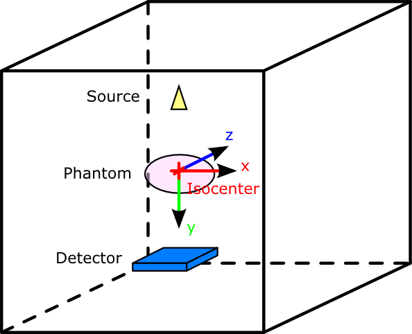
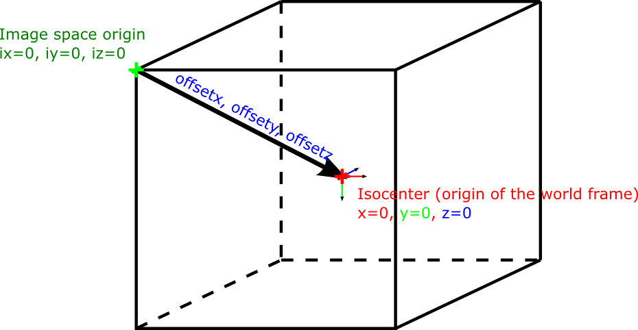

.. GGEMS documentation: Generality

.. sectionauthor:: Julien Bert

Generality
==========

Reference frame
---------------

In GGEMS the reference frame of the simulation is defined by the isocenter. Every element of the simulations (sources, phantoms and detectors) have to be placed regarding to the isocenter.

-----

.. _mhd-label:

MHD file format
---------------

GGEMS uses MHD file format to load phantom and CT image. This file format is composed of two files. One is containing the raw data of the image in binary format (.raw), and the second one containing information about the image in text format (.mhd). In the .mhd file only these keywords are used by GGEMS::

    ObjectType = Image
    NDims = 3
    BinaryData = True
    CompressedData = False
    Offset = 256.000000 126.000000 92.000000
    ElementSpacing = 4.000000 4.000000 4.000000
    DimSize = 128 63 46
    ElementType = MET_FLOAT
    ElementDataFile = phantom_pet_hu.raw

GGEMS is able to import data with ElementType defined as: ``MET_FLOAT, MET_UINT, MET_SHORT, MET_USHORT, MET_UCHAR``. The offset value is the point position that defined the center of the frame. This offset, is then used to translate the phantom accordingly, as shown to the figure:

For example to center your voxelized volume to the center of the world frame, the offset will be::

    ox = volume_size_x / 2.0
    oy = volume_size_y / 2.0
    oz = volume_size_z / 2.0

-----

System of units
---------------

Units recognized and used by GGEMS:

**Length:**

* millimeter or mm
* millimeter2 or mm2
* millimeter3 or mm3
* centimeter or cm
* centimeter2 or cm2
* centimeter3 or cm3
* meter or m
* meter2 or m2
* meter3 or m3
* kilometer or km
* kilometer2 or km2
* kilometer3 or km3
* parsec or pc
* micrometer or um
* nanometer or nm
* angstrom
* fermi
* barn
* millibarn
* microbarn
* nanobarn
* picobarn

**Angle**

* radian or rad
* milliradian or mrad
* degree or deg
* steradian or sr

**Time**

* nanosecond or ns
* second or s
* millisecond or ms
* microsecond
* picosecond
* hertz
* kilohertz
* megahertz

**Energy**

* megaelectronvolt or MeV
* electronvolt or eV
* kiloelectronvolt or keV
* gigaelectronvolt or GeV
* teraelectronvolt or TeV
* petaelectronvolt or PeV
* joule

**Mass**

* kilogram or kg
* gram or g
* milligram or mg

**Power**

* watt

**Force**

* newton

**Pressure**

* hep_pascal
* bar
* atmosphere

**Electric current**

* ampere
* milliampere
* microampere
* nanoampere

**Electric potential**

* megavolt
* kilovolt
* volt

**Electric resistance**

* ohm

**Electric capacitance**

* farad
* millifarad
* microfarad
* nanofarad
* picofarad

**Magnetic flux**

* weber

**Magnetic field**

* tesla
* gauss
* kilogauss

**Inductance**

* henry

**Temperature**

* kelvin

**Amount of substance**

* mole

**Activity**

* becquerel or Bq
* kilobecquerel or kBq
* megabecquerel or MBq
* gigabecquerel or GBq
* curie or Ci
* millicurie or mCi
* microcurie or uCi

**Absorbed dose**

* gray
* kilogray
* milligray
* microgray

**Luminous flux**

* candela

**Luminous flux**

* lumen

**Illuminance**

* lux

**Miscellaneous**

* perCent
* perThousand
* perMillion

-----

Data type
---------

GGEMS used specific data type:

* **f32** real number with simple precision
* **f32xy** vector (x, y) of f32
* **f32xyz** vector (x, y, z) of f32
* **f32xyzw** vector (x, y, z, w) of f32
*
* **f64** real number with double precision
* **f64xy** vector (x, y) of f64
* **f64xyz** vector (x, y, z) of f64
* **f64xyzw** vector (x, y, z, w) of f64
*
* **i32** signed integer number (32 bits)
* **i32xy** vector (x, y) of i32
* **i32xyz** vector (x, y, z) of i32
* **i32xyzw** vector (x, y, z, w) of i32
*
* **ui32** unsigned integer number (32 bits)
* **ui32xy** vector (x, y) of ui32
* **ui32xyz** vector (x, y, z) of ui32
* **ui32xyzw** vector (x, y, z, w) of ui32
*
* **ui16** unsigned integer number (16 bits)
* **ui16xy** vector (x, y) of ui16
* **ui16xyz** vector (x, y, z) of ui16
* **ui16xyzw** vector (x, y, z, w) of ui16
*
* **i8** signed integer number (8 bits)
* **i16** signed integer number (16 bits)
* **ui8** unsigned integer number (8 bits)
* **ui64** unsigned integer number (64 bits)
*
* **f32matrix33** matrix (a, b, c, d, e, f, g, h, i) of f32
* **f64matrix33** matrix (a, b, c, d, e, f, g, h, i) of f64

-----

Last update: |today|  -  Release: |release|.
