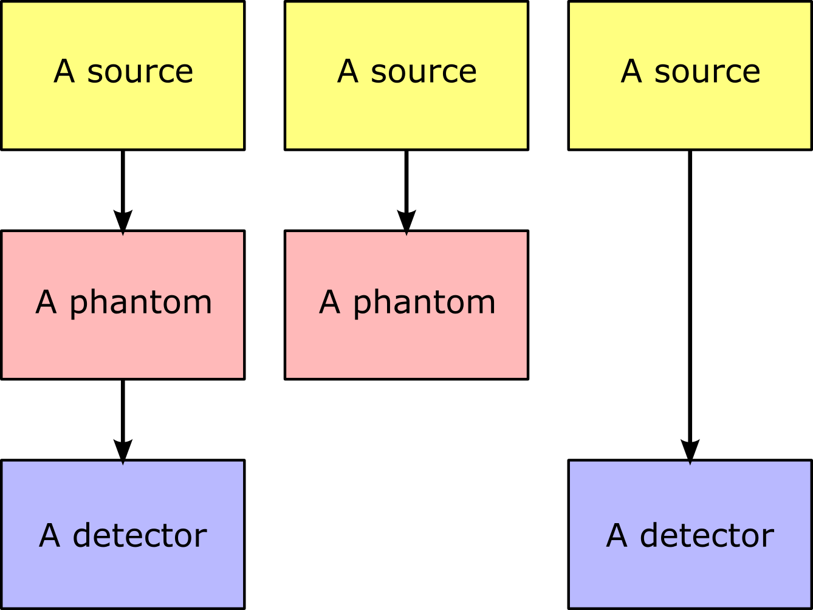

GGEMS
=====

.. sectionauthor:: Julien Bert
.. codeauthor:: Julien Bert

Simulation structure
--------------------

The structure of the Monte Carlo simulation is based on three main components: a source, a phantom and a detector. According to the targeted application, a composition of these components will be used (see figure below). For instance, to compute a blank image in CT imaging, a source and a detector will only be used (no phantom). In PET and CT imaging, a source, a phantom and a detector will be defined. In a particle therapy application, only a source and a phantom are used. For a GGEMS simulation, only the source component is mandatory, the phantom and the detector are optional.

The main code of a GGEMS application starts with the definition of the different components by instancing their associated c++ classes and setting the different required parameters. The Monte Carlo GGEMS engine has to be instantiated as well. Then, the parameters of the simulation (number of particles, physics list, etc.) are selected and every component is passed to GGEMS. Subsequently, the GGEMS engine is initialized and started. Finally, if a detector is defined, the results' data must be exported. For more information about the available components in GGEMS see :ref:`sources-label`, :ref:`phantoms-label`, :ref:`detectors-label`. The main c++ class that handles the complete simulation is ``GGEMS``. This class allows to set-up the physics list, the simulation parameters, verbosity, etc.

Example:
^^^^^^^^
.. code-block:: cpp
    :linenos:

    // Defined a source
    ConeBeamCTSource *aSource = new ConeBeamCTSource;
    // Set all parameters...

    // Defined a phantom
    VoxPhanImgNav *aPhantom = new VoxPhanImgNav;
    // Set all parameters...

    // Defined a detector
    CTDetector *aDetector = new CTDetector;
    // Set all parameters...

    // Defined a GGEMS simulation
    GGEMS *simu = new GGEMS;
    // Set simulations parameters...

    // Passed every component
    simu->set_source( aSource );
    simu->set_phantom( aPhantom );
    simu->set_detector( aDetector );

    // Init the simulation
    simu->init_simulation();

    // Start the simulation
    simu->start_simulation();

    // Get back the results
    aDetector->save_projection( outputFilename );

-----

New simulation
--------------

A GGEMS simulation must first include the ggems header in the source code:

.. code-block:: cpp
    :linenos:

    #include <ggems.cuh>

Each component of the simulation has to be instantiated and set-up (source, phantom and detector), followed by the definition of a new GGEMS object:

.. code-block:: cpp
    :linenos:

    // A new GGEMS simulation
    GGEMS *simu = new GGEMS

A GGEMS simulation requires a license data file in order to be executed. This license can be freely obtained for academic institutions. Such a file has to be passed to the simulation:

.. code-block:: cpp
    :linenos:

    // License
    simu->set_license( "license/YOUR_LICENSE_FILE.dat" );

Device architecture
-------------------

GGEMS permits to run the simulation either on a CPU or a GPU architecture.

-----

.. c:function:: void set_hardware_target( std::string name )

    Set the hardware to run the simulation

    .. c:var:: name

        Hardware name, can be ``"CPU"`` or ``"GPU"``. CPU means that the complete simulation will be executed in a single core of the CPU. GPU means that the major part of the simulation will be executed using one GPU. The default value is ``"GPU"``.

-----

.. c:function:: void set_GPU_block_size( ui32 size )

    Set the size in number of threads of each GPU block. Blocks are used to split data that has to be processed by the GPU. This size depends of your architecture and does not really change the speed of your simulation.

    .. c:var:: size

        Number of threads per block. Default value is 192.

-----

.. c:function:: void set_GPU_ID( ui32 id )

    In case of multiple GPUs or multiple graphic cards you need to select which one you want to use for running the simulation.

    .. c:var:: id

        Id of your GPU. The default value is 0, namely the first (or the unique) GPU found on your system.

Physics processes
-----------------

Physics processes from GGEMS are originally extracted from the well validated physics of `Geant4 <http://geant4.web.cern.ch/geant4/>`_ (9.4). We try as much as possible to update the processes according to each Geant4 release. So far, GGEMS includes the following physics list:

+-----------------------------------------------+-----------------------------------------------+       
| Photons                                       | Electrons                                     |  
+=======================+=======================+=======================+=======================+ 
| Process               | Model                 | Process               | Model                 | 
+-----------------------+-----------------------+-----------------------+-----------------------+ 
| Compton scattering    | standard model        | Ionisation            | Moller Bhabha model   | 
+-----------------------+-----------------------+-----------------------+-----------------------+ 
| Rayleigh scattering   | Livermore model       | Multiple scattering   | Urban93 model         | 
+-----------------------+-----------------------+-----------------------+-----------------------+ 
| Photoelectric effects | standard model        | Bremsstrahlung        | standard model        | 
+-----------------------+-----------------------+-----------------------+-----------------------+ 

-----

.. c:function:: void set_process( std::string proc_name )

    Command that activates a given physics process.

    .. c:var:: proc_name

        Name of the process, can be: ``"Compton"``, ``"Rayleigh"``, ``"PhotoElectric"``, ``"eIonisation"``, ``"eBremsstrahlung"``, ``"eMultipleScattering"``. By default all processes are disabled.

-----

.. c:function:: void set_CS_table_nbins( ui32 nb_bins )

    Cross sections and dE/dx tables are precalculated as in Geant4. A number of bins is then required for this stage.

    .. c:var:: nb_bins

        Number of bins of the physics table. This number is chosen according to your application. For medical applications, 220 bins is enough. The default value is 220.

-----

.. c:function:: void set_CS_table_E_min( f32 E_min )

    Cross sections and dE/dx tables are precalculated as in Geant4. Tables must start with a minimum energy value.

    .. c:var:: E_min

        Minimum energy in MeV used in the physics tables. Default value is 990 eV.

-----

.. c:function:: void set_CS_table_E_max( f32 E_max )

    Cross sections and dE/dx tables are precalculated as in Geant4. Tables must end with a maximum energy value.

    .. c:var:: E_max

        Maximum energy in MeV used in the physics tables. Default value is 250 MeV.

-----

.. c:function:: void set_particle_cut( std::string particle_name, f32 range )

    Energy cut can be applied to particle tracking, this command allows to define this cut in the form of a range (mm). GGEMS will calculate for each material the corresponding energy cut.

    .. c:var:: particle_name

        Particle name, can be: ``"Photon"`` or ``"Electron"``.

    .. c:var:: range

        Range cut in mm. Default value is 1 um.

.. warning::
    This is a new feature which has not yet been completely validated. Using default cut of 1 um is ok.

-----

.. c:function:: void set_secondary( std::string particle_name )

    GGEMS can handle secondary particles. Use this command to activate their tracking.

    .. c:var:: particle_name

        Particle name, can be: ``"Photon"`` or ``"Electron"``. By default no secondary particles are tracked. 

.. note::
    Secondary photon particles are not tracked yet. This means that the Bremsstrahlung process drops the photon energy locally.

-----

.. c:function:: void set_secondaries_level( ui32 level )

    During simulation, secondary particles are buffered to be processed. Therefore, this requires a particle queue. The size of such a queue is defined by the `level` of secondary particles i.e. the cascade size.

    .. c:var:: level

        Maximum level (size) of the secondary particles' queue. Default value is 0 (no secondary). For instance, for a photon beam of 1 MeV (without energy cut), a level of 6 is necessary. Namely, the secondary particles will create other secondary particles and so on, until reaching 6 levels of secondaries. The impact of these parameters on the memory size requires to store particles within the graphic card.

-----

.. c:function:: void set_geometry_tolerance( f32 range )

    Particle transportation is calculated using a raytracing function that requires a tolerance value for considering a boundary approximation between objects. This command enables to change such a tolerance.

    .. c:var:: range

        Range tolerance in mm. Default value is 100 nm.

.. warning::
    This function must be used by an expert user. Any inappropriate value will have dramatical effects on the simulation.

Execution
---------

.. c:function:: void set_source ( GGEMSSource* aSource )

    Assign a source to the simulation. This function is mandatory and therefore at least one source must be defined in GGEMS.

    .. c:var:: aSource

        Source component from the ones which are available in GGEMS ( :ref:`sources-label` ). Default value is ``NULL``.

-----

.. c:function:: void set_phantom ( GGEMSPhantom* aPhantom )

    Assign a phantom to the simulation.

    .. c:var:: aPhantom

        Phantom component from the ones which are available in GGEMS ( :ref:`phantoms-label` ). Default value is ``NULL``.

-----

.. c:function:: void set_detector( GGEMSDetector* aDetector )

    Assign a detector to the simulation.

    .. c:var:: aDetector

        Detector component from the ones which are available in GGEMS ( :ref:`detectors-label` ). Default value is ``NULL``.

-----

.. c:function:: void set_seed ( ui32 seed )

    Select a seed to initialize the pseudo random number generator.

    .. c:var:: seed

        Seed value. Default value is 0, meaning that a random seed is calculated.

-----

.. c:function:: void set_number_of_particles ( ui64 nb )

    Choose the total number of particles to simulate.

    .. c:var:: nb

        Total number of particles.

-----

.. c:function:: void set_size_of_particles_batch ( ui64 nb )

    GGEMS performs a simulation by tracking batches of particles. This command permits to choose the size of each batch.

    .. c:var:: nb

        Number of particles per batch. This number must be chosen according to the global memory available on the graphics card. For example, a simulation with a batch size of :math:`10^6` particles and 4 levels of secondary particles requires 204 MB of memory.

-----

.. c:function:: void init_simulation()

    Initializes the GGEMS simulation after everything has been properly set-up. GGEMS will then pre-calculate the physics and materials tables and load the data into the GPU memory.

-----

.. c:function:: void start_simulation()

    Start a GGEMS simulation. The simulation must have been previously initialized before running this command.

Verbosity
---------

Verbosity is useful to assess the different parameters of the simulation.

-----

.. c:function:: set_display_in_color( bool value )

    Verbosity messages can be printed in color in a linux terminal. Also, for Windows' users or for storage in a log file, it is possible to switch-off the color.

    .. c:var:: value

        Flag value, can be ``false`` or ``true``. By default this value is ``true`` except for Windows' user, where the flag is forced to ``false``.

-----

.. c:function:: set_display_memory_usage( bool value )

    This command allows to estimate the memory required by each component (source, phantom and detector). This is useful to know if the entire simulation will fit into the memory of the graphics card.

    .. c:var:: value

        Flag value, can be ``false`` or ``true``. By default this value is ``false``.

-----

.. c:function:: set_display_energy_cuts( bool value )

    Each energy cut (photon and electron) for each material is displayed.

    .. c:var:: value

        Flag value, can be ``false`` or ``true``. By default this value is ``false``.

Example
-------

.. code-block:: cpp
    :linenos:

    // GGEMS simulation
    GGEMS *simu = new GGEMS;

    // Licence
    simu->set_license( "license/YOUR_LICENSE_FILE.dat" );

    // GPU parameters
    simu->set_hardware_target( "GPU" );
    simu->set_GPU_block_size( 192 );
    simu->set_GPU_ID( 0 );

    // Physics parameters
    simu->set_process( "Compton" );
    simu->set_process( "PhotoElectric" );
    simu->set_process( "Rayleigh" );
    
    simu->set_process( "eIonisation" );
    simu->set_process( "eBremsstrahlung" );
    simu->set_process( "eMultipleScattering" );

    simu->set_secondaries_level( 6 );
    simu->set_secondary( "Electron" );

    // Energy table range
    simu->set_CS_table_nbins( 220 );
    simu->set_CS_table_E_min( 990.*eV );
    simu->set_CS_table_E_max( 250.*MeV );

    // Random and particles
    simu->set_seed( 123456789 );
    simu->set_number_of_particles( 1000000 );
    simu->set_size_of_particles_batch( 100000 );
    
    // Source and phantom
    simu->set_source( aSource );
    simu->set_phantom( aPhantom );

    // Verbose
    simu->set_display_in_color( true );    
    simu->set_display_memory_usage( true );

    // Initialization of the simulation
    simu->init_simulation();

    // Start the simulation
    simu->start_simulation();

Last update: |today|  -  Release: |release|.
