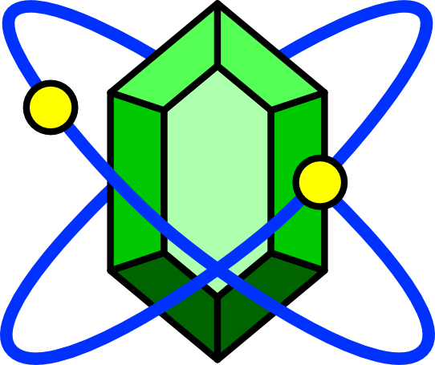

.. GGEMS documentation master file, created by
   sphinx-quickstart on Sat Feb 13 00:10:40 2016.
   You can adapt this file completely to your liking, but it should at least
   contain the root `toctree` directive.

|logo| GGEMS's documentation
============================

Contents:

.. toctree::
   :titlesonly:

   installation

   generality

   sources

   phantoms

