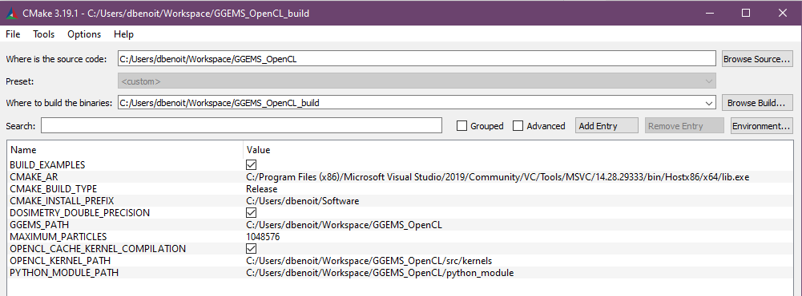

*********************
Building & Installing
*********************

.. NOTE::

  GGEMS is written in C++ and using the OpenCL C++ API. However, the most useful GGEMS functions have been wrapped to be called in pure python version 3. Python is not mandatory, GGEMS can be used in pure C++ too. Lot of C++ and python examples are given in this manual.

Prerequisites
=============
GGEMS code is based on the OpenCL library. For each platform (NVIDIA, Intel, AMD) in your computer, you have to install a specific driver provided by the vendor.

NVIDIA
------
Linux & Windows
~~~~~~~~~~~~~~~
CUDA and NVIDIA driver have to be installed if you want to use GGEMS on a NVIDIA architecture. The easiest way to install OpenCL on NVIDIA platform is to install CUDA and NVIDIA driver in the same time from the following link: https://developer.nvidia.com/cuda-downloads.

GGEMS has be tested on the lastest CUDA and NVIDIA versions, and also older versions.

.. WARNING::

  CUDA is not used in GGEMS, but the OpenCL library file in included in CUDA folder.

.. WARNING::

  It is recommanded to install CUDA and the NVIDIA driver directly from the NVIDIA website. Using packaging tool (as apt for instance) is very convenient but can produce some troubles during GGEMS executation, for instance mismatch CUDA version and NVIDIA driver.

INTEL
-----
Linux & Windows
~~~~~~~~~~~~~~~
Using GGEMS on Intel architecture require Intel driver. More information about Intel SDK for OpenCL applications can be find in the following link: https://software.intel.com/content/www/us/en/develop/tools/opencl-sdk.html. Both drivers for Linux and Windows can be downloaded here: https://software.intel.com/content/www/us/en/develop/articles/opencl-drivers.html

AMD
---
Linux & Windows
~~~~~~~~~~~~~~~
AMD platform has not be tested, but surely with few modifications GGEMS will run on a AMD platform. The correct driver for CPU and/or GPU should be available on the following link: https://www.amd.com/en/support. Don't hesitate to contact the GGEMS team if you need help for AMD implementation. For the next releases, AMD platform will be tested and validated.

.. IMPORTANT::

  All previous drivers have to be installed before to install GGEMS. Install NVIDIA driver before Intel driver is recommanded, if the user wants to use GGEMS on both architecture.

GGEMS Installation
==================
`CMAKE <https://cmake.org/>`_ is required to install GGEMS. The minimal CMAKE version is 3.8.

Linux
-----
Intel and/or NVIDIA drivers are supposed to be installed. Download GGEMS from the website, or from a terminal:

.. code-block:: console

  $ wget https://ggems.fr/download/ggems_v1.0.zip

Unzip the downloaded file, create a folder named GGEMS_build (or another name), and launch the command 'ccmake'. We recommand also to create an install folder.

.. code-block:: console

  $ unzip ggems_v1.0.zip
  $ mkdir GGEMS_build
  $ mkdir GGEMS_install
  $ cd GGEMS_build
  $ ccmake ../GGEMS

.. image:: ../images/cmake_linux_1.png
  :width: 700
  :align: center

.. image:: ../images/cmake_linux_2.png
  :width: 700
  :align: center

.. NOTE::

  By default, the GNU compiler is used by GGEMS on Linux. CLANG can be also used. To change the compiler you have to open the CMakeLists.txt file and change the compiler. Empty the CMAKE cache before to launch the compilation.

In the previous images 'YOUR_PATH' is automatically found by CMAKE. The CMAKE parameters shown previously are explained :ref:`here <CMAKE Params>`. Last step, compile and install GGEMS.

.. code-block:: console

  $ make -jN
  $ make install

Final step, configuration of your environment. There are many ways to do that. Since GGEMS is a library, you have to indicate its location in your environment file (.bashrc for instance).

.. code-block:: bash

  export LD_LIBRARY_PATH=$LD_LIBRARY_PATH:YOUR_PATH/GGEMS_install/ggems/lib

To load permanently the GGEMS python module, we also recommand to add the following line in your environment file

.. code-block:: bash

  export PYTHONPATH=$PYTHONPATH:YOUR_PATH/GGEMS_install/ggems/python_module
  export PYTHONPATH=$PYTHONPATH:YOUR_PATH/GGEMS_install/ggems/lib

GGEMS is now installed on your system. To test the installation, you can try to launch GGEMS examples or load the GGEMS python module from python console.

.. code-block:: python

  from ggems import *
  opencl_manager.print_infos()
  opencl_manager.clean()
  exit()

Windows
-------

.. NOTE::

  The following installation process for Windows is done using the classical Windows command prompt. Visual Studio is the compiler by default. CLANG can be selected by modifying the CMakeLists.txt.

.. IMPORTANT::

  Only Visual Studio (CL) and CLANG are validated on Windows. GNU GCC is not recommanded.

Visual Studio is assumed well configured. The command 'cl.exe' should be recognize in your command prompt. If not, there some useful commands to configure Visual Studio 2019 in a batch script file (named 'set_compilers.bat' for instance). If a previous version of Visual Studio code is installed on your computed, you might modify this script.

.. code-block:: batch

  @echo OFF
  if "%VCTOOLKIT_VARS_ARE_SET%" == "true" goto done

  echo --- Setting Microsoft Visual C++ Toolkit 2019 environment variables... ---

  call "C:\Program Files (x86)\Microsoft Visual Studio\2019\Community\VC\Auxiliary\Build\vcvarsall.bat" x86_amd64

  set PATH="%VCToolkitInstallDir%"\bin;%PATH%
  set INCLUDE="%VCToolkitInstallDir%"\include;%INCLUDE%
  set LIB="%VCToolkitInstallDir%"\lib;%LIB%

  set VCTOOLKIT_VARS_ARE_SET=true
  echo Done.
  :done

Launch the previous script by writing its name on the command terminal.

.. code-block:: console

  C:\Users\XXX> set_compilers.bat

Download GGEMS from the website. Unzip GGEMS in your environment folder (for instance C:\\Users\\XXX). Then create both GGEMS_build and GGEMS_install folder.

.. code-block:: console

  C:\Users\XXX> md GGEMS_build
  C:\Users\XXX> md GGEMS_install

Go to the build folder and launch CMAKE.

.. code-block:: console

  C:\Users\XXX> cd GGEMS_build
  C:\Users\XXX\GGEMS_build> cmake-gui

.. image:: ../images/cmake_win_2.png
  :width: 700
  :align: center

.. NOTE::

  For multithreaded compilation it is recommanded to use Ninja generator and not nmake. Ninja can be install as a package during visual studio installation or directly from here https://ninja-build.org/

.. IMPORTANT::

  Order during installation of NVIDIA and Intel driver could be important. To check that, go to your environment variables in PATH variable and check which OpenCL library is call first. NVIDIA OpenCL library has to be call first.

Final step, launch the compilation and installation using nmake or ninja.

.. code-block:: console

  C:\Users\XXX\GGEMS_build> nmake install

or 

.. code-block:: console

  C:\Users\XXX\GGEMS_build> ninja install

GGEMS have to be set in your environment variables by creating (or add an entry) a PYTHONPATH variable and add an entry to the PATH variable. The following batch script can do that for you in the command prompt.

.. code-block:: batch

  @echo OFF
  if "%GGEMS_VARS_ARE_SET%" == "true" goto done

  echo --- Setting GGEMS... ---
  set PYTHONPATH=%PYTHONPATH%;C:\Users\XXX\GGEMS_install\ggems\python_module
  set PYTHONPATH=%PYTHONPATH%;C:\Users\XXX\GGEMS_install\ggems\lib
  set PATH=%PATH%;C:\Users\XXX\GGEMS_install\ggems\lib

  set GGEMS_VARS_ARE_SET=true
  echo Done.
  :done

GGEMS is now installed on your system. To test the installation, you can try to launch GGEMS examples or load the GGEMS python module from python console.

.. code-block:: python

  from ggems import *
  opencl_manager.print_infos()
  opencl_manager.clean()
  exit()

.. _CMAKE Params:

CMAKE parameters
----------------
BUILD_EXAMPLES
~~~~~~~~~~~~~~
By default this option is set to ON. During the installation all examples are copied to the respective example folder.

CMAKE_INSTALL_PREFIX
~~~~~~~~~~~~~~~~~~~~
Path to your installation folder

DOSIMETRY_DOUBLE_PRECISION
~~~~~~~~~~~~~~~~~~~~~~~~~~
By default this option is set to ON. For dosimetry computation the computation are in double float precision. It's the only part of code of GGEMS to do that.

GGEMS_PATH
~~~~~~~~~~
Path found automatically by CMAKE. It corresponds to source folder for CMAKE.

MAXIMUM_PARTICLES
~~~~~~~~~~~~~~~~~
By default the batch of maximum particles simulated by GGEMS is 1048576. This number can be higher depending on your graphic cards.

OPENCL_CACHE_KERNEL_COMPILATION
~~~~~~~~~~~~~~~~~~~~~~~~~~~~~~~
By default this option is set to ON. It means the compiled OpenCL kernels are stored in the cache folder during the compilation process. It's recommanded to set this option to OFF, if you want modify code inside an OpenCL kernel and delete the OpenCL cache too.

OPENCL_KERNEL_PATH
~~~~~~~~~~~~~~~~~~
Path to GGEMS OpenCL kernels. This path is automatically found by CMAKE.

PYTHON_MODULE_PATH
~~~~~~~~~~~~~~~~~~
Path to GGEMS python module. This path is automatically found by CMAKE.