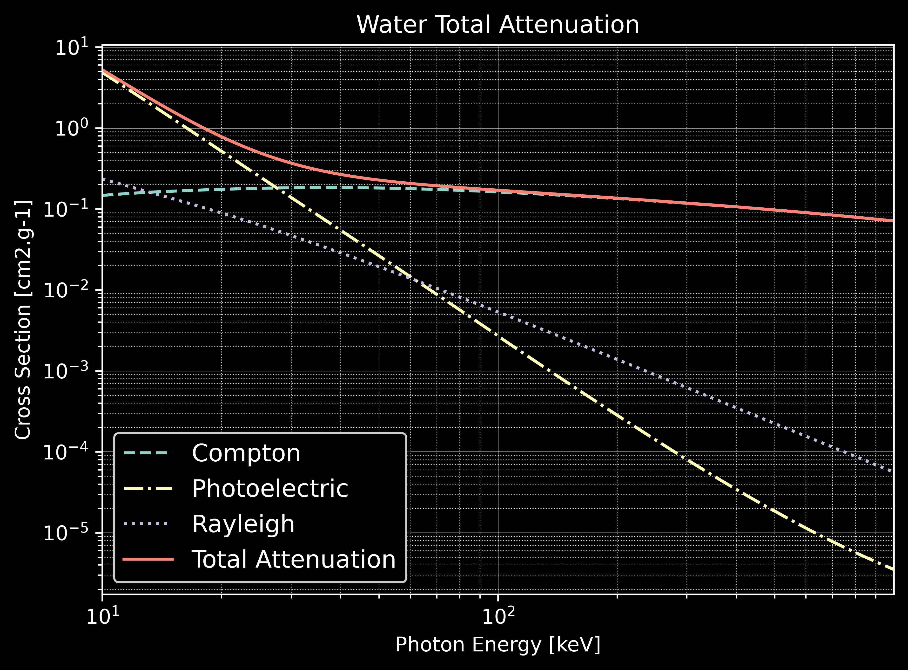
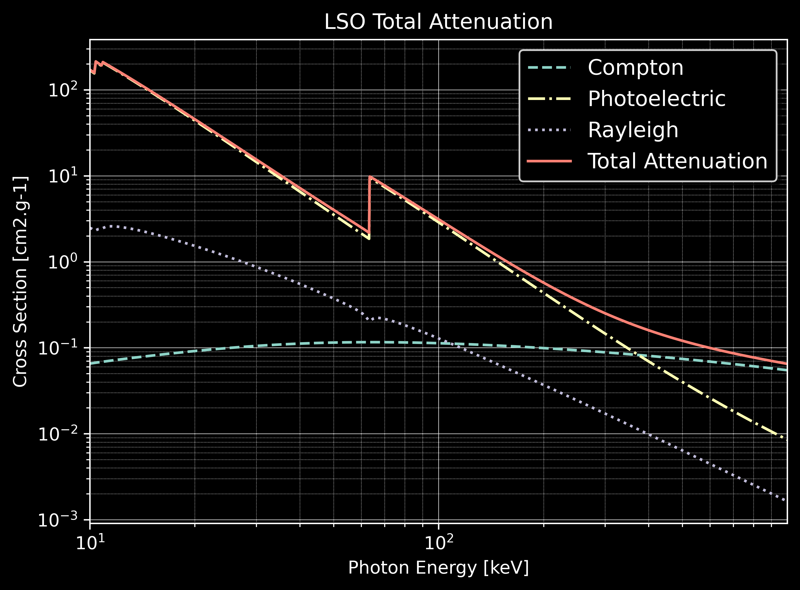
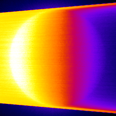

****************
Examples & Tools
****************

A list of examples and tools are provided for GGEMS users. C++ and python instructions are given. For C++, a CMakeLists.txt file is mandatory for compilation.

.. NOTE::

  Examples are compiled and installed when the compilation option 'BUILD_EXAMPLES' is set to ON. C++ executables are installed in example folders.

Example 0: Cross-section computation
====================================

The purpose of this example is to provide a tool computing cross-section for a specific material and a specific photon physical process. The energy (in MeV) and the OpenCL device are set by the user.

.. code-block:: console

  $ python cross_sections.py [-h] [-d DEVICE] [-m MATERIAL] -p [PROCESS]-e [ENERGY]
  -h/--help           Printing help into the screen
  -d/--device         Setting OpenCL id
  -m/--material       Setting one of material defined in GGEMS (Water, Air, ...)
  -p/--process        Setting photon physical process (Compton, Rayleigh, Photoelectric)
  -e/--energy         Setting photon energy in MeV

The macro is in the file 'cross_section.py'.

Verbosity level is defined in the range [0;3]. For a silent GGEMS execution, the level is set to 0, otherwise 3 for lot of informations.

.. code-block:: python

  GGEMSVerbosity(0)
  opencl_manager.set_device_index(device_id)

GGEMSMaterial object is created, and each new material can be added. The initialization step is mandatory and compute all physical tables, and store them on an OpenCL device.

.. code-block:: python

  materials = GGEMSMaterials()
  materials.add_material(material_name)
  materials.initialize()

Before using a physical process, GGEMSCrossSection object is created. Then each process can be added individually. And finally cross sections are computing by giving the list of materials.

.. code-block:: python

  cross_sections = GGEMSCrossSections()
  cross_sections.add_process(process_name, 'gamma')
  cross_sections.initialize(materials)

Getting the cross section value (in cm2.g-1) for a specific energy (in MeV) is done by the following command:

.. code-block:: python

  cross_sections.get_cs(process_name, material_name, energy_MeV, 'MeV')

Example 1: Total attenuation
============================

.. WARNING::

  This example is only available using python and the matplotlib library is mandatory.

This example is a tool for plotting the total attenuation of a material for energy between 0.01 MeV and 1 MeV. The commands are similar to example 0, and all physical processes are activated.

.. code-block:: console

  $ python total_attenuation.py [-h] [-d DEVICE] [-m MATERIAL]
  -h/--help           Printing help into the screen
  -d/--device         Setting OpenCL id
  -m/--material       Setting one of material defined in GGEMS (Water, Air, ...)

Total attenuations for Water and LSO are shown below:

Example 2: CT scanner
======================

In this CT scanner example, a water box is simulated associated to a CT curved detector. Only one projection is computed simulating 1e9 particles.

.. code-block:: console

  $ python ct_scanner.py [-h] [-d DEVICE]
  -h/--help           Printing help into the screen
  -d/--device         Setting OpenCL id

The water box phantom is loaded:

.. code-block:: python

  phantom = GGEMSVoxelizedPhantom('phantom')
  phantom.set_phantom('data/phantom.mhd', 'data/range_phantom.txt')
  phantom.set_rotation(0.0, 0.0, 0.0, 'deg')
  phantom.set_position(0.0, 0.0, 0.0, 'mm')

Then CT curved detector is built:

.. code-block:: python

  ct_detector = GGEMSCTSystem('Stellar')
  ct_detector.set_ct_type('curved')
  ct_detector.set_number_of_modules(1, 46)
  ct_detector.set_number_of_detection_elements(64, 16, 1)
  ct_detector.set_size_of_detection_elements(0.6, 0.6, 0.6, 'mm')
  ct_detector.set_material('GOS')
  ct_detector.set_source_detector_distance(1085.6, 'mm')
  ct_detector.set_source_isocenter_distance(595.0, 'mm')
  ct_detector.set_rotation(0.0, 0.0, 0.0, 'deg')
  ct_detector.set_threshold(10.0, 'keV')
  ct_detector.save('data/projection')

Initialization of cone-beam X-ray source:

.. code-block:: python

  point_source = GGEMSXRaySource('point_source')
  point_source.set_source_particle_type('gamma')
  point_source.set_number_of_particles(1000000000)
  point_source.set_position(-595.0, 0.0, 0.0, 'mm')
  point_source.set_rotation(0.0, 0.0, 0.0, 'deg')
  point_source.set_beam_aperture(12.5, 'deg')
  point_source.set_focal_spot_size(0.0, 0.0, 0.0, 'mm')
  point_source.set_polyenergy('data/spectrum_120kVp_2mmAl.dat')

.. image:: ../images/projection.png
  :width: 50
  :align: center

Performance:

+------------------------------------+------------------------+
|              Device                |  Computation Time [s]  |
+====================================+========================+
|  GeForce GTX 1050 Ti               | 128                    |
+------------------------------------+------------------------+
|  Quadro P400                       | 404                    |
+------------------------------------+------------------------+
|  Xeon X-2245 8 cores / 16 threads  | 132                    |
+------------------------------------+------------------------+

Example 3: Voxelized phantom generator
======================================

A tool creating voxelized phantom is provided by GGEMS. Only basic shapes are available such as tube, box and sphere. The output format is MHD, and the range material data file is created in same time than the voxelized volume.

.. code-block:: console

  $ python generate_volume.py [-h] [-d DEVICE]
  -h/--help           Printing help into the screen
  -d/--device         Setting OpenCL id

First step is to create global volume storing all other voxelized objets. Dimension, voxel size, name of output volume, format data type and material are defined.

.. code-block:: python

  volume_creator_manager.set_dimensions(450, 450, 450)
  volume_creator_manager.set_element_sizes(0.5, 0.5, 0.5, "mm")
  volume_creator_manager.set_output('data/volume')
  volume_creator_manager.set_range_output('data/range_volume')
  volume_creator_manager.set_material('Air')
  volume_creator_manager.set_data_type('MET_INT')
  volume_creator_manager.initialize()

Then a voxelized volume can be drawn in the global volume. A box object is built with the command lines below:

.. code-block:: python

  box = GGEMSBox(24.0, 36.0, 56.0, 'mm')
  box.set_position(-70.0, -30.0, 10.0, 'mm')
  box.set_label_value(1)
  box.set_material('Water')
  box.initialize()
  box.draw()
  box.delete()

Example 4: Dosimetry
====================

In dosimetry example, a cylinder is simulated computing absorbed dose inside it. Different results such as dose, energy deposited... can be plotted. An external source, using GGEMS X-ray source is simulated generating 2e8 particles.

First, the cylinder phantom is loaded:

.. code-block:: python

  phantom = GGEMSVoxelizedPhantom('phantom')
  phantom.set_phantom('data/phantom.mhd', 'data/range_phantom.txt')
  phantom.set_rotation(0.0, 0.0, 0.0, 'deg')
  phantom.set_position(0.0, 0.0, 0.0, 'mm')

Then dosimetry object is associated to the previous phantom, storing all data during particle tracking:

.. code-block:: python

  dosimetry = GGEMSDosimetryCalculator('phantom')
  dosimetry.set_output('data/dosimetry')
  dosimetry.set_dosel_size(0.5, 0.5, 0.5, 'mm')
  dosimetry.water_reference(False)
  dosimetry.minimum_density(0.1, 'g/cm3')
  dosimetry.uncertainty(True)
  dosimetry.photon_tracking(True)
  dosimetry.edep(True)
  dosimetry.hit(True)
  dosimetry.edep_squared(True)

And finally an external source using GGEMSXRaySource is created:

.. code-block:: python

  point_source = GGEMSXRaySource('point_source')
  point_source.set_source_particle_type('gamma')
  point_source.set_number_of_particles(200000000)
  point_source.set_position(-595.0, 0.0, 0.0, 'mm')
  point_source.set_rotation(0.0, 0.0, 0.0, 'deg')
  point_source.set_beam_aperture(5.0, 'deg')
  point_source.set_focal_spot_size(0.0, 0.0, 0.0, 'mm')
  point_source.set_polyenergy('data/spectrum_120kVp_2mmAl.dat')

.. figure:: ../images/dosimetry_dose.png
    :width: 50%
    :align: center

    Dose absorbed by cylinder phantom

.. figure:: ../images/dosimetry_uncertainty.png
    :width: 50%
    :align: center

    Uncertainty dose computation

    Photon tracking in phantom

Performance:

+------------------------------------+------------------------+
|              Device                |  Computation Time [s]  |
+====================================+========================+
|  GeForce GTX 1050 Ti               | 253                    |
+------------------------------------+------------------------+
|  Quadro P400                       | 1228                   |
+------------------------------------+------------------------+
|  Xeon X-2245 8 cores / 16 threads  | 570                    |
+------------------------------------+------------------------+