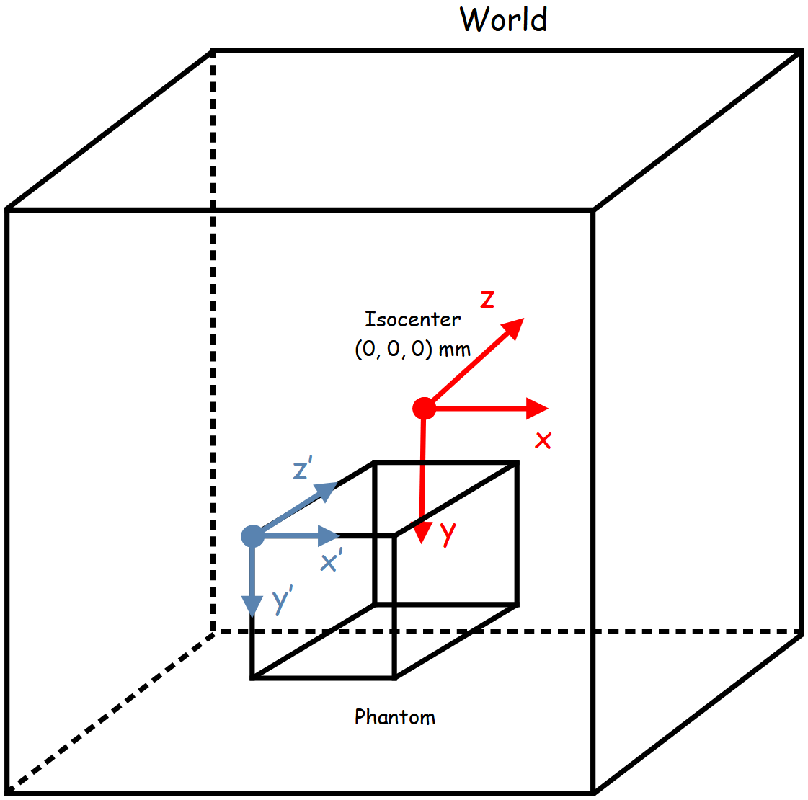

********
Phantoms
********

In GGEMS, a voxelized phantom is the only available type of phantom. This phantom
is defined in a mhd file and a range data file, storing all label data. The reference
axis of the phantom are the same than the global world volume

First a phantom is created by choosing a name, and loading a mhd file and a range
data file:

.. code-block:: python

  phantom = GGEMSVoxelizedPhantom('phantom')
  phantom.set_phantom('phantom.mhd', 'range_phantom.txt')

The user can set a position and a set_rotation of the phantom using the following
commands:

.. code-block:: python

  phantom.set_rotation(0.0, 0.0, 0.0, 'deg')
  phantom.set_position(0.0, 0.0, 0.0, 'mm')
