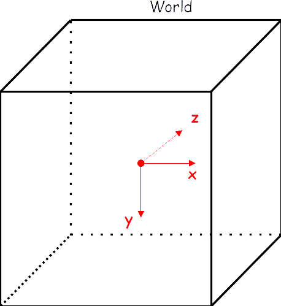

**************
World and Axis
**************

In GGEMS, the world volume is not simulated. When a batch of particles is generated, they are projected to the closest volume, then tracked within the volume. World is equivalent to 'vacuum' material.

The center of the world corresponds to the global isocenter at position (0, 0, 0) mm. Axis X, Y and Z correspond to the axis of input image phantom. For instance in the case of a patient pahntom, Z axis corresponds to the bed axis. All other objects in GGEMS, such as source, system and detector are positioned and rotated along world axis.

