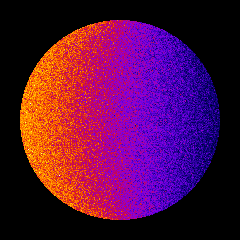
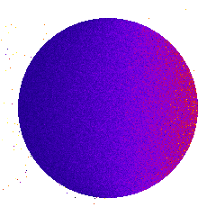

*********************
Examples 4: Dosimetry
*********************

In dosimetry example, a cylinder is simulated computing absorbed dose inside it. Different results such as dose, energy deposited... can be plotted. An external source, using GGEMS X-ray source is simulated generating 2e8 particles.

.. code-block:: console

  $ python dosimetry_photon.py [-h] [-d DEVICE] [-b BALANCE] [-n N_PARTICLES] [-s SEED] [-v VERBOSE]
  -h/--help           Printing help into the screen
  -d/--device         OpenCL device (all, cpu, gpu, gpu_nvidia, gpu_intel, gpu_amd, "X;Y;Z"...)
                      using all gpu: -d gpu
                      using device index 0 and 2: -d "0;2"
  -b/--balance        Balance computation for device if many devices are selected "X;Y;Z"
                      60% computation on device 0 and 40% computatio on device 2: -b "0.6;0.4"
  -n/--nparticles     Number of particles (default: 1000000)
  -s/--seed           Seed of pseudo generator number (default: 777)
  -v/--verbose        Setting level of verbosity

First, the cylinder phantom is loaded:

.. code-block:: python

  phantom = GGEMSVoxelizedPhantom('phantom')
  phantom.set_phantom('data/phantom.mhd', 'data/range_phantom.txt')
  phantom.set_rotation(0.0, 0.0, 0.0, 'deg')
  phantom.set_position(0.0, 0.0, 0.0, 'mm')

Then dosimetry object is associated to the previous phantom, storing all data during particle tracking:

.. code-block:: python

  dosimetry = GGEMSDosimetryCalculator('phantom')
  dosimetry.set_output('data/dosimetry')
  dosimetry.set_dosel_size(0.5, 0.5, 0.5, 'mm')
  dosimetry.water_reference(False)
  dosimetry.minimum_density(0.1, 'g/cm3')
  dosimetry.uncertainty(True)
  dosimetry.photon_tracking(True)
  dosimetry.edep(True)
  dosimetry.hit(True)
  dosimetry.edep_squared(True)

And finally an external source using GGEMSXRaySource is created:

.. code-block:: python

  point_source = GGEMSXRaySource('point_source')
  point_source.set_source_particle_type('gamma')
  point_source.set_number_of_particles(200000000)
  point_source.set_position(-595.0, 0.0, 0.0, 'mm')
  point_source.set_rotation(0.0, 0.0, 0.0, 'deg')
  point_source.set_beam_aperture(5.0, 'deg')
  point_source.set_focal_spot_size(0.0, 0.0, 0.0, 'mm')
  point_source.set_polyenergy('data/spectrum_120kVp_2mmAl.dat')

    Dose absorbed by cylinder phantom

    Uncertainty dose computation

.. figure:: ../images/dosimetry_photon_tracking.png
    :width: 50%
    :align: center

    Photon tracking in phantom

Performance:

+------------------------------------+------------------------+
|              Device                |  Computation Time [s]  |
+====================================+========================+
|  GeForce GTX 1050 Ti               | 253                    |
+------------------------------------+------------------------+
|  GeForce GTX 980 Ti                | 65                     |
+------------------------------------+------------------------+
|  Quadro P400                       | 1228                   |
+------------------------------------+------------------------+
|  Xeon X-2245 8 cores / 16 threads  | 570                    |
+------------------------------------+------------------------+
