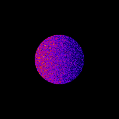
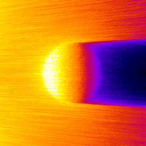
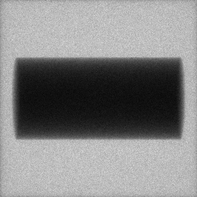
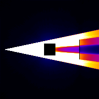

**************************
Examples 5: World Tracking
**************************

In world tracking example, a cylinder is simulated computing absorbed dose inside it, a CBCT flat panel detector is also defined storing photon count. And finally a world is defined in order to store the fluence outside cylinder phantom and detector. An external source, using GGEMS X-ray source is simulated generating 1e8 particles.

.. code-block:: console

  $ python world_tracking.py [-h] [-d DEVICE] [-b BALANCE] [-n N_PARTICLES] [-s SEED] [-v VERBOSE]
  -h/--help           Printing help into the screen
  -d/--device         OpenCL device (all, cpu, gpu, gpu_nvidia, gpu_intel, gpu_amd, "X;Y;Z"...)
                      using all gpu: -d gpu
                      using device index 0 and 2: -d "0;2"
  -b/--balance        Balance computation for device if many devices are selected "X;Y;Z"
                      60% computation on device 0 and 40% computatio on device 2: -b "0.6;0.4"
  -n/--nparticles     Number of particles (default: 1000000)
  -s/--seed           Seed of pseudo generator number (default: 777)
  -v/--verbose        Setting level of verbosity

First the world is defined, and all output are generated

.. code-block:: python

  world = GGEMSWorld()
  world.set_dimensions(200, 200, 200)
  world.set_element_sizes(10.0, 10.0, 10.0, 'mm')
  world.set_output_basename('data/world')

  world.energy_tracking(True)
  world.energy_squared_tracking(True)
  world.momentum(True)
  world.photon_tracking(True)

The created cylinder phantom is loaded and dosimetry module is associated to the cylinder phantom, and all output are activated

.. code-block:: python

  phantom = GGEMSVoxelizedPhantom('phantom')
  phantom.set_phantom('data/phantom.mhd', 'data/range_phantom.txt')
  phantom.set_rotation(0.0, 0.0, 0.0, 'deg')
  phantom.set_position(0.0, 0.0, 0.0, 'mm')

  dosimetry = GGEMSDosimetryCalculator()
  dosimetry.attach_to_navigator('phantom')
  dosimetry.set_output_basename('data/dosimetry')
  dosimetry.set_dosel_size(1.0, 1.0, 1.0, 'mm')
  dosimetry.water_reference(False)
  dosimetry.minimum_density(0.1, 'g/cm3')

  dosimetry.uncertainty(True)
  dosimetry.photon_tracking(True)
  dosimetry.edep(True)
  dosimetry.hit(True)
  dosimetry.edep_squared(True)

A CBCT flat panel detector is built

.. code-block:: python

  cbct_detector = GGEMSCTSystem('custom')
  cbct_detector.set_ct_type('flat')
  cbct_detector.set_number_of_modules(1, 1)
  cbct_detector.set_number_of_detection_elements(400, 400, 1)
  cbct_detector.set_size_of_detection_elements(1.0, 1.0, 10.0, 'mm')
  cbct_detector.set_material('Silicon')
  cbct_detector.set_source_detector_distance(1500.0, 'mm')
  cbct_detector.set_source_isocenter_distance(900.0, 'mm')
  cbct_detector.set_rotation(0.0, 0.0, 0.0, 'deg')
  cbct_detector.set_threshold(10.0, 'keV')
  cbct_detector.save('data/projection.mhd')

And finally an external source using GGEMSXRaySource is created:

.. code-block:: python

  point_source = GGEMSXRaySource('point_source')
  point_source.set_source_particle_type('gamma')
  point_source.set_number_of_particles(100000000)
  point_source.set_position(-900.0, 0.0, 0.0, 'mm')
  point_source.set_rotation(0.0, 0.0, 0.0, 'deg')
  point_source.set_beam_aperture(12.0, 'deg')
  point_source.set_focal_spot_size(0.0, 0.0, 0.0, 'mm')
  point_source.set_monoenergy(60.0, 'keV')

    Dose absorbed by cylinder phantom

    Photon tracking in phantom

    Cylinder projection on flat panel detector

    World photon tracking

Performance:

+------------------------------------+------------------------+
|              Device                |  Computation Time [s]  |
+====================================+========================+
|  GeForce GTX 1050 Ti               | 363                    |
+------------------------------------+------------------------+
|  GeForce GTX 980 Ti                | 390                    |
+------------------------------------+------------------------+
|  Quadro P400                       | 908                    |
+------------------------------------+------------------------+
|  Xeon X-2245 8 cores / 16 threads  | 284                    |
+------------------------------------+------------------------+
