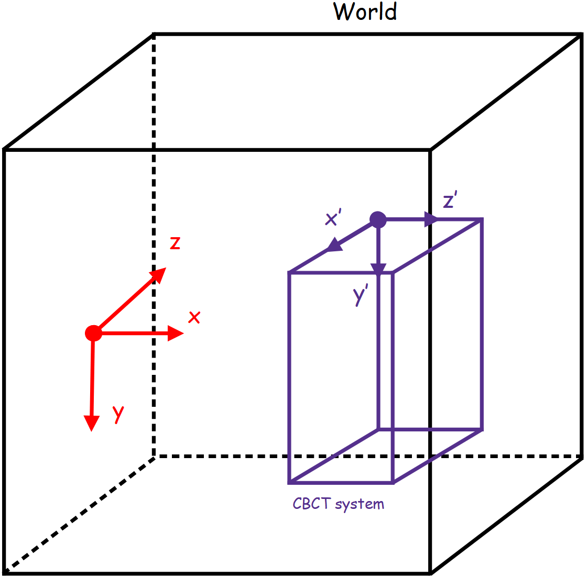

*******
Systems
*******

In GGEMS, only CT/CBCT system is available for moment. This detector is composed
by pixels arranged in modules. The following figure shows the reference axis of
CT/CBCT system.

A CT/CBCT system is created using the following line:

.. code-block:: python

    cbct_system = GGEMSCTSystem('detector')

Types of CT/CBCT detector are:

    * flat panel
    * curved

Flat panel
==========
This type of geometry is well adapted for CBCT configuration.

.. code-block:: python

    cbct_system.set_ct_type('flat')

.. figure:: ../images/cbct2.png
    :width: 100%
    :align: center

Curved
======
This type of geometry is well adapted for CT configuration.

.. code-block:: python

    cbct_system.set_ct_type('curved')

.. figure:: ../images/cbct3.png
    :width: 100%
    :align: center

.. NOTE::

    For curved geometry, the angle between modules is automatically computed. The center
    of rotation is the source position, and there is no gap between modules.

For each type of detector, number of modules, number of detection elements
within module and their sizes are set as following:

.. code-block:: python

    cbct_system.set_number_of_modules(1, 3)
    cbct_system.set_number_of_detection_elements(12, 4, 1)
    cbct_system.set_size_of_detection_elements(1.0, 1.0, 1.0, 'mm')

Detector can be composed by one type of material:

.. code-block:: python

    cbct_system.set_material('GOS')

And a threshold can be applyied specifically to the detector:

.. code-block:: python

    cbct_system.set_threshold(10.0, 'keV')

Source isocenter distance (SID) and source detector distance (SDD) is set with the following commands:

.. code-block:: python

    cbct_system.set_source_detector_distance(1085.6, 'mm')
    cbct_system.set_source_isocenter_distance(595.0, 'mm')

The CT/CBCT system can be rotated around world axis as following:

.. code-block:: python

    cbct_system.set_rotation(0.0, 0.0, 0.0, 'deg')

Final projection is saved in a MHD file and scatter registration can be activated:

.. code-block:: python

    cbct_system.save('projection')
    cbct_system.store_scatter(True)